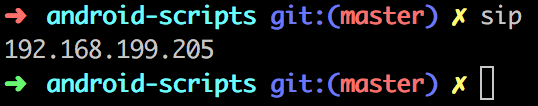

# android-scripts
:books:把平时碰到和Android有关的手动操作、人工检查等写成脚本或插件，提高效率和准确度

PS：

:computer:运行环境：Mac OS

## ```Python```相关脚本
1. [merge_language_strings.py](http://blog.csdn.net/sunzhaojie613/article/details/78634791)<br/>用于自动合入Android不同语言文案，并对待合入的文案进行特殊符号格式检查和纠正（目前支持单双引号、%）。使用方法和原理详见[Android脚本插件系列(一)：Android国际化多语自动合入脚本](http://blog.csdn.net/sunzhaojie613/article/details/78634791)

## ```Shell```相关脚本
1. [sinstall.sh](http://blog.csdn.net/sunzhaojie613/article/details/78937891)<br/>用于自动打包安装并语音提示，较AndroidStudio自带的编译有安装成功率高、执行结束有语音提示无需开发者时刻关注等优点。使用方法和原理详见[Android脚本插件系列(二)：自动打包安装并语音提示脚本
](http://blog.csdn.net/sunzhaojie613/article/details/78937891)

2. sip.sh<br/>直接显示本机IP地址( ```ifconfig``` 中第一个网卡的IP)<br/>
